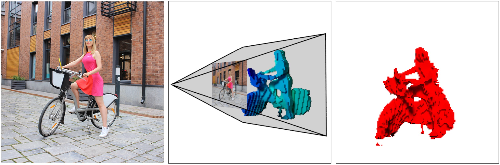

# Z-GAN
This is the PyTorch implementation of the color-to-voxel model translation presented on ECCV 2018.

The code is based on the PyTorch [implementation](https://github.com/junyanz/pytorch-CycleGAN-and-pix2pix) of the pix2pix and CycleGAN.

#### Z-GAN: [[Project]](http://www.zefirus.org/Z_GAN) [[Paper]](http://cmp.felk.cvut.cz/sixd/workshop_2018/)


If you use this code for your research, please cite:

```
@InProceedings{Kniaz2018,
author="Kniaz, Vladimir A. and
Knyaz, Vladimir V. and Fabio Remondino,
title={Image-to-Voxel Model Translation with Conditional Adversarial Networks},
booktitle={{Computer Vision -- ECCV 2018 Workshops",
year="2018}},
publisher={Springer International Publishing},
}
```

## Prerequisites
- Linux or macOS
- Python 2 or 3
- CPU or NVIDIA GPU + CUDA CuDNN

## Getting Started
### Installation
- Install PyTorch and dependencies from http://pytorch.org
- Install Torch vision from the source.
```bash
git clone https://github.com/pytorch/vision
cd vision
python setup.py install
```
- Install python libraries [visdom](https://github.com/facebookresearch/visdom) and [dominate](https://github.com/Knio/dominate).
```bash
pip install visdom
pip install dominate
```
- Clone this repo:
```bash
git clone https://github.com/vlkniaz/Z_GAN
```

### Z-GAN train/test
- Go to the repo directory
```
cd Z_GAN
```

- Download a Z-GAN dataset:
```bash
bash ./datasets/download_zgan_dataset.sh mini
```
- Train a model:
```bash
bash scripts/train_zgan.sh
```
- To view training results and loss plots, run `python -m visdom.server` and click the URL http://localhost:8097. To see more intermediate results, check out `./checkpoints/thermal_gan_rel/web/index.html`
- Test the model:
```bash
bash scripts/test_zgan.sh
```
The test results will be saved to a html file here: `./results/z_gan/test_latest/index.html`.

### Apply a pre-trained model (Z-GAN)

Download a pre-trained model with `./pretrained_models/download_zgan_model.sh`.

- For example, if you would like to download Z-GAN model on the mini dataset,
```bash
bash pretrained_models/download_zgan_model.sh Z_GAN
```

- Download the mini datasets
```bash
bash ./datasets/download_zgan_dataset.sh mini
```
- Then generate the results using
```bash
bash scripts/test_zgan_pretrained.sh
```

- The test results will be saved to a html file here: `./results/Z_GAN_pretrained/test_latest/index.html`.

